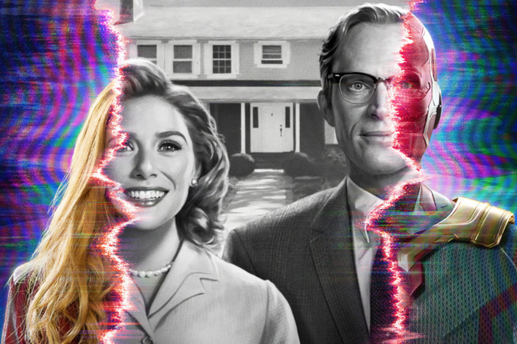
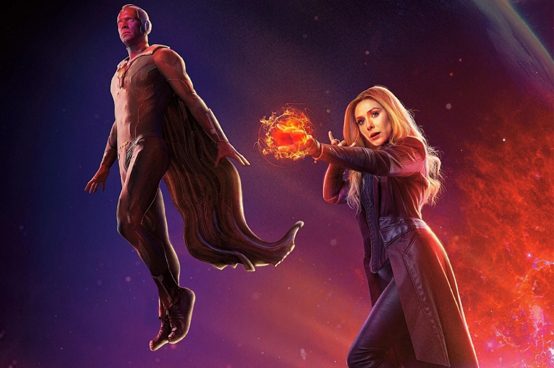

# "M Day" and classic costumes: What was shown in the trailer of the series "Wanda/Vision".

During the break of the Emmy 2020 award Marvel and Disney+ presented the first trailer of the mini-series "Wanda/Vision". Judging by the video, the viewers will see a very unusual project - with the change of reality, references to classic comedy series and the feeling that everything that happens is a fake. We get to know what we saw in the trailer.

## Newlyweds 

The film starts with a black and white frame: Wanda and Vision drive into a nice suburb of Westview in a car with the inscription "Newlyweds". These scenes recreate the look and feel of old American TV series like "I Love Lucy" and "My Wife Mesmerized Me". Wanda and Vision play a happy couple - enjoy a new home, a married life in a world without Avengers, super villains and other problems.

However, the new life is not as joyful as it might seem at first sight. In addition to the annoying neighbor performed by Katherine Hahn (we will return to her later), there are also the characters Debra Joe Rapp and Fred Melamed, who insist on Wanda and Vision to tell about their lives. At this point, the reality around the characters starts to crack.

## Renaissance Vision

The main question of the series is how did Vision come to life, killed by Tanos in "War of Infinity". It is assumed that he was resurrected by Wanda, using new opportunities of his superpowers. In Marvel, the heroine Elizabeth Olsen used them mostly for telekinesis, but in comics she is able to change reality.

Judging by the video, Wanda used her powers to not just make a copy of her lover, but to really bring him back from the dead. In the dinner scene, you can see that Paul Bettany's hero begins to doubt the reality of what is happening, and in the other scene, already in the familiar form of Marvel movies watching life in Westview from above. All this actually confirms that the resurrected Vision has its own mind and is not part of Wanda.

In addition, the Stone of Mind, the source of his life, burns in Vision's forehead. Either Wanda was able to recreate one of the Stones of Infinity, or she found a replacement for an important part of Vision.
